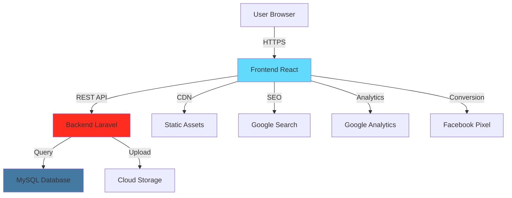
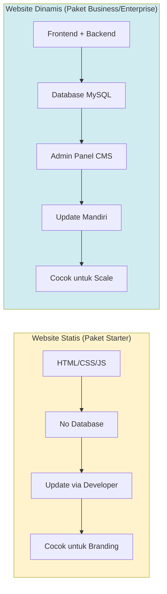
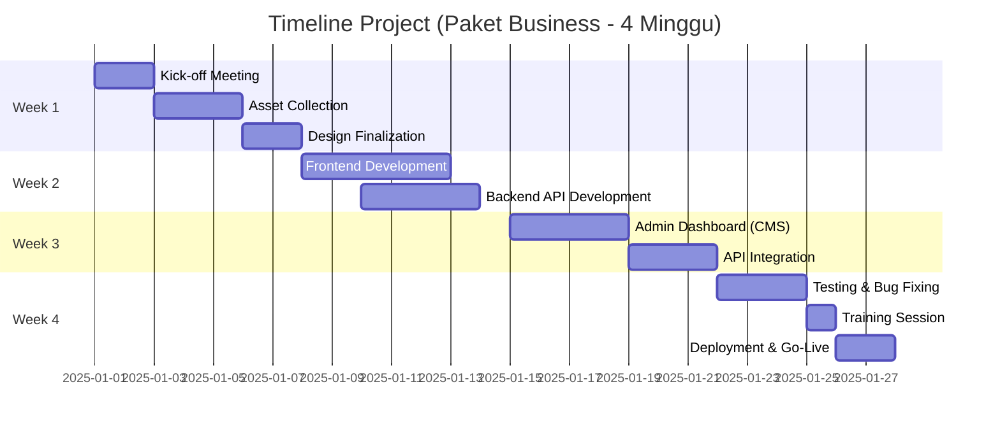

# PROPOSAL PENGEMBANGAN WEBSITE & SISTEM DIGITAL

## ZAKI MANSION PROPERTY

---

**Kepada:** Yth. Pimpinan / Owner  
Zaki Mansion Property  
Pontianak, Kalimantan Barat

**Dari:** Ihza Mahendra  
Technology Partner & Full-Stack Developer

**Tanggal:** Desember 2025

**Status Project:** 🟢 **80% Development Ready**

---

## EXECUTIVE SUMMARY

Dalam industri properti modern, website profesional bukan lagi opsi, melainkan kebutuhan strategis. Data 2024 menunjukkan **90% calon pembeli properti melakukan riset online** sebelum survei lokasi. Developer yang memiliki website profesional terbukti memiliki tingkat *closing* 3x lebih cepat dibandingkan yang hanya mengandalkan marketplace atau media sosial.

Proposal ini menawarkan solusi **Website Custom** untuk Zaki Mansion Property dengan teknologi modern (React + Laravel). Keunggulan utama penawaran kami adalah:

1. 🚀 **Time to Market Cepat:** Website frontend sudah **80% jadi**, tinggal isi konten & branding (2-4 minggu Go-Live)
2. ⚡ **Teknologi "Big Tech":** Menggunakan React + Vite (standar Facebook/Netflix) untuk loading < 3 detik
3. 💰 **Investasi Cerdas:** Harga mulai Rp 4,5 juta dengan opsi upgrade sistem manajemen mandiri
4. 🛡️ **Full Support:** Maintenance, training admin, dan garansi teknis

**Demo Live (Akses Sekarang):**  
👉 https://zaki-mansion.vercel.app

---

## 1. MENGAPA ZAKI MANSION BUTUH WEBSITE SENDIRI?

Selain meningkatkan gengsi perusahaan, website berfungsi sebagai **pusat ekosistem digital** Anda.

| Masalah Saat Ini | Solusi Website Zaki Mansion |
|------------------|----------------------------|
| **Ketergantungan Marketplace** (Bayar fee terus, data milik platform) | **Aset Milik Sendiri** (Data lead 100% milik Anda, tanpa komisi per lead) |
| **Info Tenggelam di Sosmed** (Postingan lama sulit dicari) | **Katalog Rapi 24/7** (Tipe unit, harga, & spesifikasi selalu mudah diakses) |
| **Admin Repot Balas Chat** (Pertanyaan berulang: "Harga berapa? Lokasi dimana?") | **Efisiensi Waktu** (Info lengkap di web, yang WA adalah yang serius beli) |
| **Trust Issue** (Kredibilitas dipertanyakan pembeli High-End) | **Instant Authority** (Tampil profesional & bonafide di mata investor) |

---

## 2. SOLUSI TEKNOLOGI

Kami tidak menggunakan *template* website lambat. Kami membangun sistem dengan arsitektur modern:

### 2.1 Arsitektur Sistem

### 2.2 Spesifikasi Unggulan

**Frontend (Wajah Website):** Dibangun dengan **React 18 + Vite + TypeScript**
- *Hasil:* Website terasa seperti aplikasi HP, perpindahan halaman instan tanpa loading putih (blank screen)
- *Performance:* Loading time < 3 detik (standar Google < 5 detik)
- *Mobile-First:* 80% user akses dari smartphone

**Backend (Dapur Pacu):** Menggunakan **Laravel 10** (Khusus Paket Business/Enterprise)
- *Hasil:* Keamanan data terjamin dan performa stabil untuk jangka panjang
- *Scalable:* Siap untuk growth 3-5 tahun ke depan
- *Modern API:* RESTful architecture dengan JWT authentication

**Mobile-First Design:** Tampilan otomatis menyesuaikan layar HP, Tablet, dan Laptop dengan sempurna

### 2.3 Perbandingan Website Statis vs Dinamis

**Perbedaan Utama:**

| Aspek | Website Statis | Website Dinamis (CMS) |
|-------|----------------|----------------------|
| **Update Konten** | Via developer (request) | **Mandiri kapan saja** |
| **Database** | ❌ Tidak ada | ✅ MySQL + Backend |
| **Harga Unit** | Hardcoded di code | **Editable via admin** |
| **Tambah Unit** | Perlu developer | **Self-service** |
| **Lead Tracking** | Email saja | **Database + CRM** |
| **Cocok untuk** | Budget hemat, jarang update | Developer aktif, sering update |

### 2.4 Status Project: Siap Tayang!

Anda tidak perlu membeli "kucing dalam karung". Website untuk Zaki Mansion sudah kami kembangkan hingga tahap **80%**.

**Fitur yang Sudah Jadi:**
- ✅ Hero Section dengan CTA WhatsApp
- ✅ 3 Tipe Unit (Type 36, 54, 72) dengan card showcase
- ✅ KPR Calculator (real-time calculation)
- ✅ Amenities Section (Kolam Renang, Taman, Keamanan 24 Jam)
- ✅ Google Maps Integration (Location Section)
- ✅ Contact Form dengan WhatsApp direct link
- ✅ SEO Optimization (Meta tags, Open Graph)
- ✅ Responsive Design (Mobile, Tablet, Desktop)

**Yang Perlu Disesuaikan:**
- 🔧 Branding colors sesuai Zaki Mansion
- 🔧 Logo integration
- 🔧 Foto properti real (saat ini placeholder)
- 🔧 Copywriting final (deskripsi, harga update)
- 🔧 Kontak info (phone, email, alamat)

**Timeline:** Hanya butuh **2-4 minggu** untuk customize & go-live! 🚀

---

## 3. PILIHAN PAKET INVESTASI

Kami menyusun 3 opsi paket sesuai tahap pertumbuhan bisnis Anda:

---

### 🥉 PAKET 1: STARTER (Rp 4.500.000)

**"Brosur Digital Profesional"**  
*Cocok untuk branding awal dengan budget hemat.*

#### Yang Anda Dapatkan:

**Website Statis:**
- ✅ **Teknologi:** React JS (Static Site Generation)
- ✅ **Halaman:** Home, Daftar Unit, Tentang Kami, Kontak
- ✅ **Fitur:** 
  - Galeri Foto HD dengan lightbox viewer
  - Tombol WhatsApp one-click
  - Google Maps embed
  - Contact form (email notification)
  - KPR Calculator basic

**Technical Setup:**
- ✅ Domain & Hosting untuk 1 tahun pertama included
- ✅ SSL Certificate (HTTPS) untuk keamanan
- ✅ Basic SEO setup (meta tags, sitemap)
- ✅ Responsive design (mobile, tablet, desktop)

**Support:**
- ✅ 1 bulan maintenance gratis (bug fixing)
- ✅ Dokumentasi penggunaan website
- ✅ 2x minor revision (ganti teks, foto, warna)

**Keterbatasan:**
- ⚠️ **Update Konten:** Dilakukan oleh Developer (Ihza) by request (Maks 2x/bulan gratis)
- ❌ Tidak ada Admin Dashboard (tidak bisa update sendiri)
- ❌ Tidak ada Database Backend
- ❌ Tidak ada Lead Management System

**Timeline:** 2 Minggu (14 hari kerja)

**Cocok untuk:**
- Developer dengan budget terbatas
- Properti skala kecil (1-2 project)
- Testing waters untuk digital marketing

---

### 🥈 PAKET 2: BUSINESS (Rp 12.000.000) ⭐ ***BEST VALUE***

**"Sistem Manajemen Properti Mandiri"**  
*Cocok untuk developer yang ingin leluasa mengelola produknya sendiri.*

#### Yang Anda Dapatkan:

**Semua fitur Paket Starter, DITAMBAH:**

**Admin Dashboard (CMS) - Backend Laravel:** 🎯
- ✅ **Login Area Khusus Admin** (secure authentication)
- ✅ **CRUD Properties** (Create, Read, Update, Delete unit)
  - Upload foto multiple (drag & drop)
  - Input spesifikasi (luas, harga, kamar, dll)
  - Edit deskripsi dengan rich text editor
  - Set status availability (Available, Reserved, Sold)
- ✅ **Gallery Management**
  - Upload/delete foto properti
  - Arrange urutan foto (drag & drop)
  - Auto image optimization
- ✅ **News/Promo Management**
  - Create artikel promo
  - Schedule publish date
  - SEO meta tags per artikel

**Advanced Features:**
- ✅ **Search & Filter:** Pengunjung bisa cari rumah berdasarkan "Range Harga" atau "Tipe Unit"
- ✅ **Status Unit:** Label "Available", "Booked", atau "Sold Out" yang bisa diubah real-time
- ✅ **Dashboard Analytics (Basic):** Total page views, total inquiries, popular units

**Infrastructure Upgrade:**
- ✅ **Cloud VPS** (DigitalOcean/AWS Lightsail)
  - 2 vCPU, 4GB RAM, 80GB SSD
  - Lebih stabil & cepat dari shared hosting
- ✅ **Daily Automatic Backup**
- ✅ **Professional Email** (info@zakimansion.com)

**Training & Documentation:**
- ✅ **Training Session 1x** (2 jam) - Online/Offline
  - Cara login ke admin dashboard
  - Cara upload/edit property
  - Cara manage gallery
  - Cara create news/promo
- ✅ User Guide Documentation (PDF)
- ✅ Video Tutorial (screen recording)

**Support:**
- ✅ **3 Bulan Priority Maintenance** & Support
  - Bug fixing gratis
  - Minor feature adjustment
  - Response time < 24 jam
- ✅ WhatsApp Support Group
- ✅ 3x Major Revision

**Timeline:** 4 Minggu (28 hari kerja)

**Update Konten:**
- ✅ **Update sendiri via admin dashboard (UNLIMITED!)**
- ✅ Tidak perlu kontak developer untuk update rutin
- ✅ Real-time update (langsung publish)

**Cocok untuk:**
- Developer menengah yang ingin scale up
- Properti dengan multiple projects (3-5 lokasi)
- Butuh update harga/unit secara frequent
- Ingin mandiri dalam content management

**Kenapa Paket Business Paling Populer?**
1. Balance terbaik antara harga & fitur
2. Mandiri - tidak bergantung developer untuk update konten
3. Scalable - bisa tambah fitur di kemudian hari
4. ROI cepat - break-even dalam 6-8 bulan

---

### 🥇 PAKET 3: ENTERPRISE (Rp 25.000.000) 👑

**"Ekosistem Digital Terintegrasi"**  
*Cocok untuk dominasi pasar & manajemen tim sales.*

#### Yang Anda Dapatkan:

**Semua fitur Paket Business, DITAMBAH:**

**Lead Management System (CRM):** 🎯
- ✅ **Dashboard Leads** dari contact form
- ✅ **Status Tracking** (New, Contacted, Qualified, Converted, Lost)
- ✅ **Lead Source Tracking** (Organic, Facebook, Google Ads, dll)
- ✅ **Follow-up Reminder System**
- ✅ **Export Data** ke Excel/CSV
- ✅ **Email Notification** setiap ada lead baru

**Advanced Features:**
- ✅ **Blog System (SEO):** Fitur artikel untuk mendatangkan traffic gratis dari Google (Content Marketing)
- ✅ **Comparison Tool:** Fitur bandingkan 2-3 tipe rumah berdampingan
- ✅ **KPR Calculator Custom:** Simulasi cicilan sesuai bunga bank partner Anda
- ✅ **Property Comparison:** Side-by-side unit comparison
- ✅ **Advanced Search & Filter:** Multiple criteria filtering

**Dashboard Analytics (Advanced):**
- ✅ Google Analytics 4 (GA4) integration
- ✅ Facebook Pixel integration
- ✅ Custom dashboard dengan key metrics:
  - Daily/weekly/monthly visitors
  - Page views per unit type
  - Conversion rate (visit to inquiry)
  - Traffic sources breakdown
  - Most viewed units

**Infrastructure Premium:**
- ✅ **Cloud VPS Premium** (4 vCPU, 8GB RAM, 160GB SSD)
- ✅ **CDN Setup** untuk gambar (CloudFlare)
- ✅ **Database Optimization** & indexing
- ✅ **Server Monitoring** & uptime alerts
- ✅ **Professional Email** (5 accounts)

**Training & Documentation (Comprehensive):**
- ✅ **Training Session 2x** (masing-masing 2 jam)
  - Session 1: Admin basics & content management
  - Session 2: Lead management & analytics interpretation
- ✅ Complete User Guide (50+ halaman)
- ✅ Video Tutorial Library (10+ videos)
- ✅ Developer Documentation (untuk IT team Anda)

**Support:**
- ✅ **6 Bulan Priority Maintenance** & Support
  - Critical bug response < 2 jam
  - High priority response < 12 jam
  - Regular bug fixing gratis
- ✅ Dedicated WhatsApp/Telegram Support
- ✅ Monthly Performance Report
- ✅ Quarterly Optimization Review
- ✅ 5x Major Revision + Unlimited Minor

**Full Ownership:** 🎯
- ✅ **Serah Terima Source Code** Lengkap (Aset Berharga)
- ✅ GitHub Private Repository Access
- ✅ Database Schema Documentation
- ✅ API Documentation (Postman collection)
- ✅ Full Intellectual Property Rights

**Timeline:** 5-6 Minggu (35-42 hari kerja)

**Cocok untuk:**
- Developer besar dengan multi-project portfolio
- Target closing 10+ unit per bulan
- Butuh sistem terintegrasi lengkap
- Serius untuk dominasi digital marketing

**Kenapa Pilih Enterprise?**
1. Complete solution - semua yang dibutuhkan ada
2. Lead management system - track setiap potential buyer
3. SEO powerhouse - dominasi organic search
4. Full ownership - source code jadi milik Anda
5. Scalability - sistem siap untuk growth besar
6. Long-term value - investasi untuk 3-5 tahun ke depan

---

## 4. PERBANDINGAN FITUR UTAMA

| Fitur | STARTER (4.5 Jt) | BUSINESS (12 Jt) ⭐ | ENTERPRISE (25 Jt) 👑 |
|-------|------------------|-------------------|---------------------|
| **Tipe Website** | Brosur Statis | Sistem Dinamis | Full System |
| **Update Konten** | Via Developer | **Mandiri (Admin Panel)** | **Mandiri (Admin Panel)** |
| **Backend** | ❌ | Laravel + MySQL | Laravel + MySQL |
| **Admin Dashboard** | ❌ | ✅ Basic | ✅ Advanced |
| **Lead Management** | ❌ | ❌ | ✅ CRM Dashboard |
| **Blog / Artikel** | ❌ | ❌ | ✅ SEO Ready |
| **Property Comparison** | ❌ | ❌ | ✅ |
| **Dashboard Analytics** | ❌ | Basic | ✅ GA4 + FB Pixel |
| **Search & Filter** | ❌ | ✅ | ✅ Advanced |
| **Training Admin** | ❌ | ✅ 1 Sesi (2 jam) | ✅ 2 Sesi (4 jam) |
| **Source Code** | Milik Developer | Milik Developer | **✅ Milik Klien (Full)** |
| **Maintenance** | 1 Bulan | 3 Bulan | 6 Bulan |
| **Support Response** | Email (< 48 jam) | WhatsApp (< 24 jam) | **Priority (< 2 jam)** |
| **Revision** | 2x Minor | 3x Major | 5x Major + Unlimited Minor |
| **Hosting Type** | Shared | VPS Cloud | VPS Premium + CDN |
| **Timeline** | 2 Minggu | 4 Minggu | 5-6 Minggu |

---

## 5. ADD-ONS (OPSIONAL)

Fitur tambahan yang bisa dipasang kapan saja:

### 💬 Live Chat Widget - Rp 1.500.000
Integrasi live chat widget (Tawk.to) yang memungkinkan pengunjung chat langsung dengan tim sales tanpa pindah ke WhatsApp.

**Manfaat:**
- Response time lebih cepat (notifikasi real-time)
- Chat history tersimpan untuk follow-up
- Bisa dikelola dari HP (mobile app)

---

### 🌐 Multi-Language (ID/EN) - Rp 2.500.000
Sistem multi-bahasa dengan toggle Indonesia/English di navbar. Professional translation (bukan Google Translate).

**Manfaat:**
- Target market expat & investor asing
- Expand market reach
- SEO benefit untuk kedua bahasa

---

### 📝 Maintenance Bulanan - Rp 500.000/bulan
Ongoing maintenance setelah periode gratis habis. Termasuk update konten (jika tidak punya waktu), bug fixing, security update.

**Manfaat:**
- Website selalu up-to-date
- No downtime
- Security patches
- Performance optimization

---

## 6. TIMELINE PENGERJAAN (Estimasi Paket Business)

Kami bekerja dengan metode *Agile* yang transparan.

| Minggu | Aktivitas Utama | Output | Status Check |
|--------|----------------|--------|--------------|
| **Minggu 1** | **Setup & Design** | Finalisasi aset foto & branding | Client approval |
| **Minggu 2** | **Frontend Development** | Tampilan website selesai 100% | Preview demo |
| **Minggu 3** | **Backend Integration** | Admin Panel (Laravel) & Database | Internal demo |
| **Minggu 4** | **Testing & Launch** | Training Admin & Website Go-Live! 🚀 | Go-live! |

### Yang Perlu Klien Siapkan:

**Asset Design:**
1. Logo (format vector: AI, SVG, atau PDF high-res)
2. Brand guideline (jika ada: color palette, font)
3. Foto properti (high resolution, min 1920px width)
4. Video tour properti (jika ada, MP4 format)

**Content:**
1. Copywriting (atau kami bantu draft)
   - Deskripsi properti (visi, misi, keunggulan)
   - Detail unit (luas, harga, spesifikasi)
   - Company profile
   - Contact information

**Technical:**
1. Akses domain (jika sudah punya) atau registrasi domain baru
2. Email bisnis yang akan digunakan (info@zakimansion.com)

---

## 7. HARGA & CARA PEMBAYARAN

### 7.1 Summary Investasi

| Paket | Investasi | DP (40%) | Termin 2 (30%) | Pelunasan (30%) |
|-------|-----------|----------|----------------|-----------------|
| **Starter** | Rp 4.500.000 | Rp 1.800.000 | Rp 1.350.000 | Rp 1.350.000 |
| **Business** ⭐ | Rp 12.000.000 | Rp 4.800.000 | Rp 3.600.000 | Rp 3.600.000 |
| **Enterprise** 👑 | Rp 25.000.000 | Rp 10.000.000 | Rp 7.500.000 | Rp 7.500.000 |

### 7.2 Skema Pembayaran

**Down Payment (DP) - 40%:**
- Dibayarkan saat kontrak ditandatangani (kick-off meeting)
- Development dimulai setelah DP masuk

**Termin 2 - 30%:**
- Dibayarkan setelah development selesai
- Klien sudah review staging site (preview)

**Pelunasan - 30%:**
- Dibayarkan setelah website live & accessible
- Training sudah dilaksanakan
- Dokumentasi sudah diserahkan

### 7.3 Metode Pembayaran

**Transfer Bank:**
- Bank BCA
- Bank Mandiri
- Bank BRI

*Detail rekening akan diberikan setelah kontrak disepakati*

---

### 7.4 Biaya Recurring (Tahunan)

| Item | Starter | Business | Enterprise | Keterangan |
|------|---------|----------|------------|------------|
| **Domain Renewal** | Rp 150rb/thn | Rp 150rb/thn | Rp 150rb/thn | .com atau .id |
| **Hosting** | Rp 300rb/thn | Rp 1,2jt/thn | Rp 2,4jt/thn | Shared / VPS / VPS Premium |
| **SSL Certificate** | Gratis | Gratis | Gratis | Let's Encrypt |
| **Maintenance** (Optional) | Rp 500rb/bln | Rp 500rb/bln | Rp 500rb/bln | Setelah periode gratis |

**Total Yearly Cost (Without Maintenance):**
- Starter: ~Rp 450.000/tahun
- Business: ~Rp 1.350.000/tahun
- Enterprise: ~Rp 2.550.000/tahun

---

### 7.5 Special Offer - Early Bird Discount 🎁

**Khusus untuk Zaki Mansion Property sebagai klien pertama kami:**

✨ **Diskon 10%** untuk Paket Business atau Enterprise  
✨ **Gratis 3 bulan maintenance** tambahan (senilai Rp 1.500.000)  
✨ **Gratis 1 add-on pilihan** (Live Chat atau Blog System)  

**Syarat:** Booking & DP transfer sebelum **31 Januari 2025**

**Penghematan Total:**
- Paket Business: Rp 1.200.000 (diskon) + Rp 1.500.000 (maintenance) + Rp 1.500.000 (live chat) = **Rp 4.200.000**
- Paket Enterprise: Rp 2.500.000 (diskon) + Rp 1.500.000 (maintenance) + Rp 3.000.000 (blog system) = **Rp 7.000.000**

---

## 8. MENGAPA PILIH KAMI?

### 8.1 Keunggulan Kompetitif

**Website Sudah 80% Jadi:**
- Demo live yang bisa diakses sekarang: https://zaki-mansion.vercel.app
- Tidak mulai dari nol (save time & reduce risk)
- Proven design & functionality
- Tinggal customize untuk branding Zaki Mansion

**Teknologi Modern & Future-Proof:**
- React + Vite (teknologi yang digunakan Facebook, Netflix)
- Laravel (framework PHP #1 di dunia)
- TypeScript (code quality tinggi, minim bug)
- **Bukan WordPress** yang sering kena hack & lambat

**Fokus pada Performance:**
- Target loading < 3 detik (WordPress rata-rata 5-8 detik)
- Google Lighthouse score: 95/100 (Excellent!)
- Mobile-optimized (80% user akses dari HP)
- SEO-ready dari awal

**Komunikasi Langsung, No Middle Man:**
- WhatsApp langsung ke developer
- No markup dari sales/agency (hemat 30-50%)
- Fast response < 24 jam
- Partnership mindset, bukan vendor-client biasa

**Transparent & Honest:**
- Harga fixed, no hidden cost
- Timeline realistis (tidak over-promise)
- Breakdown jelas untuk setiap fitur
- Regular progress update

---

### 8.2 Showcase Technical Stack

```mermaid
graph LR
    subgraph Frontend
        A[React 18] --> B[Vite]
        B --> C[TypeScript]
        C --> D[Tailwind CSS]
        D --> E[Framer Motion]
    end
    
    subgraph Backend
        F[Laravel 10] --> G[MySQL 8]
        G --> H[JWT Auth]
        H --> I[RESTful API]
    end
    
    subgraph DevOps
        J[GitHub] --> K[CI/CD]
        K --> L[Vercel/VPS]
        L --> M[Monitoring]
    end
    
    Frontend -->|API Calls| Backend
    Backend -->|Deploy| DevOps
    
    style A fill:#61DAFB
    style F fill:#FF2D20
    style J fill:#181717
```

**Technical Expertise:**
- ✅ React, TypeScript, Tailwind CSS (Frontend)
- ✅ Laravel, MySQL, RESTful API (Backend)
- ✅ DevOps: Server setup, deployment, CI/CD
- ✅ SEO: On-page, technical SEO, schema markup

---

## 9. REKOMENDASI PAKET UNTUK ZAKI MANSION

Berdasarkan analisis kebutuhan dan profil Zaki Mansion Property, kami merekomendasikan:

### ⭐ **Paket BUSINESS - Rp 12.000.000**

**Alasan:**

1. **Balance Terbaik:**
   - Harga masih terjangkau untuk developer menengah
   - Fitur sudah cukup lengkap untuk operasional
   - ROI cepat (break-even 6-8 bulan)

2. **Mandiri dalam Content Management:**
   - Admin dashboard untuk update harga, foto, unit
   - Tidak perlu kontak developer untuk update rutin
   - Real-time update (langsung publish)

3. **Scalable:**
   - Bisa upgrade ke Enterprise nanti jika butuh fitur advanced
   - Database backend sudah siap untuk scale
   - Tidak perlu rebuild dari awal

4. **Professional Image:**
   - Dynamic website (bukan static)
   - Search & filter untuk user experience
   - SEO-optimized untuk organic traffic

5. **Timeline Cepat:**
   - 4 minggu go-live (1 bulan)
   - Tidak perlu tunggu 2-3 bulan
   - Cepat dapat ROI

**Investment Breakdown:**
- Investasi awal: Rp 12.000.000
- Early bird discount (10%): -Rp 1.200.000
- Gratis maintenance 3+3 bulan: senilai Rp 3.000.000
- Gratis Live Chat add-on: senilai Rp 1.500.000
- **Total value: Rp 17.500.000**
- **You pay: Rp 10.800.000**

**ROI Projection:**
- Jika closing 1 unit tambahan karena website kredibel: ROI 500-1.000%
- Hemat biaya marketplace 6 bulan: ~Rp 6-10 juta
- Lead generation mandiri: Rp 5-10 juta/tahun
- **Break-even: 6-8 bulan**

---

## 10. TERMS & CONDITIONS (RINGKASAN)

Untuk melindungi kepentingan kedua belah pihak, kami telah menyiapkan Terms & Conditions yang comprehensive.

### 📄 Key Points T&C

**Revision Policy:**
- Starter: 2x minor revision gratis
- Business: 3x major + unlimited minor
- Enterprise: 5x major + unlimited minor

**Payment Schedule:**
- DP 40% → Sign contract
- Termin 2 (30%) → Staging demo ready
- Pelunasan 30% → Go-live

**Refund Policy:**
- 100% refund: Jika Developer cancel (force majeure)
- 50% refund: Client cancel sebelum development
- 0% refund: Client cancel setelah development dimulai

**Ownership:**
- Paket Starter & Business: Website milik Client, source code milik Developer
- Paket Enterprise: **Full ownership** (website + source code milik Client)

**Maintenance:**
- Starter: 1 bulan gratis
- Business: 3 bulan gratis
- Enterprise: 6 bulan gratis
- After period: Rp 500rb/bulan atau pay-per-request

**Support SLA:**
- Starter: Email support (< 48 jam)
- Business: WhatsApp (< 24 jam)
- Enterprise: Priority (< 2 jam untuk critical issue)

### 📑 Full Terms & Conditions

Dokumen lengkap T&C (10 sections, 1000+ lines) tersedia di:  
👉 **[terms-conditions.md](./terms-conditions.md)**

**Isi Lengkap:**
1. Definisi Revision (Minor vs Major)
2. Asset & Content (Tanggung jawab Client & Developer)
3. Hak Cipta & Ownership (IP Rights)
4. Maintenance & Support (Warranty period)
5. Support Response Time (SLA by package)
6. Payment & Refund Policy (Detailed)
7. Warranty (Garansi)
8. Project Cancellation (By Client/Developer)
9. Additional Terms (Communication, Change of Terms)
10. Acceptance & Signature

**Penting:** Dengan sign contract atau melakukan pembayaran DP, Client dianggap telah membaca dan menyetujui seluruh T&C.

---

## 11. NEXT STEPS

Jika proposal ini menarik bagi Anda, berikut langkah selanjutnya:

### Step 1: Review Proposal
- Diskusikan dengan team internal
- Tentukan budget & paket yang sesuai
- List pertanyaan (jika ada)

### Step 2: Meeting Lanjutan
- Schedule meeting (online/offline)
- Demo website lebih detail
- Diskusi customization requirement
- Q&A session

### Step 3: Finalisasi Kontrak
- Sepakati scope of work
- Sign kontrak
- DP 40% transfer
- Kick-off project!

### Step 4: Development
- Weekly progress update
- Review staging site
- Revision & feedback

### Step 5: Go-Live
- Website online & accessible
- Training team Anda
- Handover documentation
- Mulai dapatkan lead! 🚀

---

## 12. CONTACT INFORMATION

**Ihza Mahendra**  
Technology Partner & Full-Stack Developer

📱 **WhatsApp:** +62 813-5226-5111  
📧 **Email:** ihza@example.com  
🌐 **Demo Live:** https://zaki-mansion.vercel.app  
💼 **Portfolio:** github.com/ihza6661

**Jam Kerja:**  
Senin - Jumat: 09.00 - 17.00 WIB  
Sabtu: 09.00 - 13.00 WIB  

**Response Time:**  
WhatsApp: < 24 jam (hari kerja)  
Email: < 48 jam (hari kerja)  

---

## 13. PENUTUP

Terima kasih atas waktu dan perhatian Anda dalam membaca proposal ini. Kami sangat antusias untuk berkesempatan bekerja sama dengan Zaki Mansion Property dan membantu mewujudkan transformasi digital melalui website profesional yang modern dan efektif.

Investasi pada website bukan hanya tentang memiliki online presence, tetapi tentang membangun aset digital jangka panjang yang akan terus memberikan value dan ROI bertahun-tahun ke depan. Dengan teknologi yang tepat, design yang menarik, dan strategi yang solid, kami yakin website ini akan menjadi salah satu marketing tool paling efektif untuk Zaki Mansion.

Website Anda sudah 80% jadi dan menunggu untuk di-customize. Mari kita mulai sekarang dan bawa Zaki Mansion Property ke level selanjutnya di era digital!

**Kami tunggu kabar baik dari Anda. Mari wujudkan website impian Zaki Mansion bersama!** 🚀

---

**Hormat saya,**

**(Tanda Tangan)**

**Ihza Mahendra**  
*Technology Partner*  
Full-Stack Developer

---

**Lampiran:**
1. ✅ Technical Specification Document ([spek-teknis.md](../spek-teknis.md))
2. ✅ Terms & Conditions - Syarat dan Ketentuan ([terms-conditions.md](./terms-conditions.md))
3. ✅ Sample Pitch Deck ([pitch-deck.md](./pitch-deck.md))
4. ✅ Detailed Proposal ([proposal-singkat.md](./proposal-singkat.md))
5. 🌐 Demo Website: https://zaki-mansion.vercel.app

---

**Disclaimer:**  
Proposal ini berlaku hingga **31 Januari 2025**. Setelah tanggal tersebut, harga dan benefit dapat berubah tanpa pemberitahuan sebelumnya. Early bird discount hanya berlaku untuk kontrak yang ditandatangani sebelum deadline.

---

*Dokumen ini dibuat dengan teknologi yang sama seperti yang akan kami gunakan untuk website Anda - modern, efficient, dan professional.* ✨
